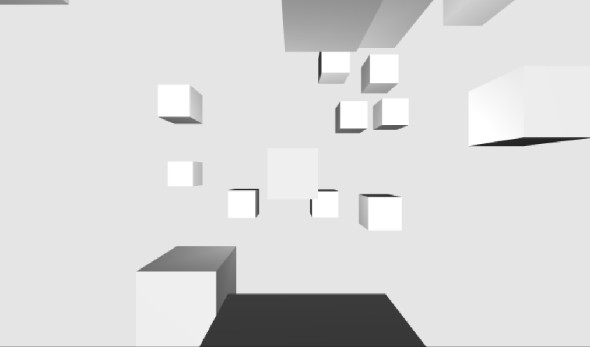

## Three.js + GreenSock 模拟简单随机动画
### 什么是three.js
Three.js封装了底层的图形接口，使得程序员能够在无需掌握繁冗的图形学知识的情况下，也能用简单的代码实现三维场景的渲染，相对于webGL，Three.js封装了底层的图形接口，在不了解图形学的情况下，也能用简单的代码实现三维场景的渲染
### 开始使用
CDN引入
```
 <script src="https://cdnjs.cloudflare.com/ajax/libs/three.js/109/three.js"></script>
<script src="https://cdnjs.cloudflare.com/ajax/libs/gsap/2.1.2/TweenMax.min.js"></script>
```
### 创建环境
一个基本的Three.js程序至少要包括渲染器（Renderer）、场景（Scene）、照相机（Camera），以及你在场景中创建的物体。
- 场景（Scene）
  放置所有物体的空间容器，三维空间。直接new一个Scene类创建调用3d场景的实例
` new scene = new THREE.Scene()`
- 照相机（Camera）
  three.js 采用的是右手坐标系
  
  共有四种：立方相机（Cube Camera）、正交（Orthographic Camera）、透视（Perspective Camera）、立体（Stereo Camera）。
  常用：正投影相机（THREE.OrthographicCamera） 和透视投影相机（THREE.PerspectiveCamera）。
  其中 透视投影相机 （PerspectiveCamera）更真实的模仿人眼中的现实世界，本例也将用到
  THREE.PerspectiveCamera(fov, aspect, near, far）
  其构造函数接受四个不同的参数，接受参数类型皆为Number
fov — 摄像机视锥体垂直视野角度
aspect — 摄像机视锥体长宽比
near — 摄像机视锥体近端面
far — 摄像机视锥体远端面


```
 var camera = new THREE.PerspectiveCamera(
                75,//视野纵横比
                window.innerWidth / window.innerHeight,//基于浏览器宽高
                0.1,//近端距离 near
                1000,//远端距离 far
            )
//设置相机在z轴上的位置
    camera.position.z = 5;
```
- 渲染器（Renderer）
    渲染器分别有 webGL| CSS2d | CSS3d | SVG ,其中webGL最灵活强大
  
```
var renderer = new THREE.WebGLRenderer({
    antialias: true, //是否反锯齿。默认为false
    /*
    canvas: canvas, //供渲染器绘制其输出的canvas,如果没有传这个参数，会创建一个新canvas
    precision:'highp', // 着色器精度. highp|mediump|lowp|highp(默认)
    alpha: flase, // canvas是否包含alpha (透明度)。默认为 false
    stencil: flase // 绘图缓存是否有模板缓存。默认为true
     */
    });
 renderer.setClearColor("#e5e5e5");
 renderer.setSize(window.innerWidth,window.innerHeight);

```
创建好后把 renderer 生成的 dom 结构（其实就是一个 canvas 标签）append 到 html 里
 `document.body.appendChild(renderer.domElement);`


 ### 创建物体
环境布置好了，还差环境里的物体
Three.js 中提供了很多类型的物体，它们都继承自 Object3D 类，包括线段（Line）、骨骼（Bone）、粒子系统（ParticleSystem）。比较常见的是Mesh（网格）,网格是由顶点、边、面等组成的物体，网格越多，物体表面越平滑,更接近模仿真实。

任何物体都有形状，材质
- 形状geometry
形状有超多种嗷...圆环，球体，柱体，柱体，文字形状...各种各样任君挑选，但都是简单基本模型，复杂模型还是需要导入的，支持导入*.obj 的外部模型
- 材质material 
  材质（Material）是独立于物体顶点信息之外的与渲染效果相关的属性。通过设置材质可以改变物体的颜色、纹理贴图、光照模式
  这里采用的是Lambert材质（MeshLambertMaterial）是符合Lambert光照模型的材质。Lambert光照模型的主要特点是只考虑漫反射而不考虑镜面反射的效果，对于大部分物体的漫反射效果都是适用的。
```
      //3d物体包括物理形状和材料
      var geometry = new THREE.BoxGeometry(1, 1, 1);//半径、宽度、圆滑度
      var material = new THREE.MeshLambertMaterial({color: 0xf7f7f7});
      //创建MESH模型
      var mesh = new THREE.Mesh(geometry, material);
```

这个时候打开浏览器是一个黑不溜秋的丑丑正方形，好像和3d搭不上边嗷...

其实这里还缺了关键的灯光，不同的光影效果可以让画面更丰富。
Three.js 提供了包括环境光 (AmbientLight)、点光源 (PointLight)、聚光灯 (SpotLight)、方向光 (DirectionalLight)、半球光 (HemisphereLight) 等多种光源。
只要在场景中添加需要的光源,再加上一定的物体旋转就好了。这里用到PointLight,
```
    var light = new THREE.PointLight(0xffffff, 1, 500);//颜色，强度，距离
    light.position.set(0,0,10); //设置光源位置
    scene.add(light);
    mesh.rotation.set(45,45,0);

```

### 制作动画
动效库有很多，这里用使用gasp(green sock)复杂动画序列使用的时间轴插件TimelineMax,详见文档[tweenmax中文手册](https://www.tweenmax.com.cn/api/timelinemax/)

#### 添加射线
浏览器是一个2d视口，而在里面显示three.js的内容是3d场景，所以，现在有一个问题就是如何将2d视口的x和y坐标转换成three.js场景中的3d坐标。three.js已经有了解决相关问题的方案，那就是THREE.Raycaster射线，用于鼠标去获取在3D世界被鼠标选中的一些物体

```
//声明raycaster和mouse变量
    var raycaster = new THREE.Raycaster();
    var mouse = new THREE.Vector3();
```
光线投射Raycaster使用的是官方文档里的案例[光线投射](https://threejs.org/docs/index.html#api/zh/core/Raycaster)

#### TweenMax API
  -  .to( target, duration, vars, position) 

  参数|类型|说明
--|:--:|:--
 target|Object|需要动画的对象
duration|	Number|	动画持续的秒数（或帧）
vars	|Object |动画参数（CSS属性、延迟、重复次数等）
position|		|插入动画的位置 
 - ease：过渡效果的速度曲线（缓动效果），在动画的参数中设置各种缓动来控制动画的变化率
        Expo 特殊缓动

```
 function onMouseMove(event){
      event.preventDefault();
      // 将鼠标位置归一化为设备坐标。x 和 y 方向的取值范围是 (-1 to +1)            
      mouse.x = ( event.clientX / window.innerWidth ) * 2 - 1;
      mouse.y = - ( event.clientY / window.innerHeight ) * 2 + 1;
      //传入光线,通过摄像机和鼠标位置更新射线
      raycaster.setFromCamera( mouse, camera );
      // 计算物体和射线的焦点
      var intersects = raycaster.intersectObjects( scene.children ,true);
          for(let i = 0; i<intersects.length ; i++){
              //选中与射线相交的物体
                  this.tl = new TimelineMax().delay(.3);
                  //添加动效
                  this.tl.to(intersects[i].object.scale, 1, {x:2, ease: Expo.easeOut})//网点，持续时间
                  this.tl.to(intersects[i].object.scale, .5, {x:.5, ease: Expo.easeOut})
                  this.tl.to(intersects[i].object.position, .5, {x:2, ease: Expo.easeOut})
                  this.tl.to(intersects[i].object.rotation, .5, {y:Math.PI*.5, ease: Expo.easeOut}, "=-1.5")//提前-1.5s发生
                }
                }
            render();
            //添加监听事件
            window.addEventListener('mousemove', onMouseMove)
```
这个时候可以看到物体已经动起来了

### 效果实现
可以看到最后的效果是随机创建一个个模型并分散在页面上的，所以这里循环创建多个模型，通过random改变其在 x , y , z上的position来达到“迎面而来” 动画效果
```
    meshCount = 0;
    for( var i = 0 ;i < 20 ;i++) {
        var mesh = new THREE.Mesh(geometry, material);
        mesh.position.x =( Math.random() - 0.5) *10;
        mesh.position.y =( Math.random() - 0.5) *10;
        mesh.position.z =( Math.random() - 0.5) *10;
        scene.add(mesh);
        meshCount++;
  }
```
这个时候可以看出光是不够的，需要再加一个光源,光源的位置坐标、强度、距离、衰退量可以根据自己的感觉调节
```
var light = new THREE.PointLight(0xffffff, 1, 1000);//颜色，强度，距离
light.position.set(0,0,0);
scene.add(light);
```
多个随机模型 效果如图

### 响应式
通过浏览器大小自动改变渲染的模型大小
```
 //监听窗口改变同时更新
  window.addEventListener('resize',()=>{
      renderer.setSize(window.innerWidth,window.innerHeight);
      camera.aspect = window.innerWidth / window.innerHeight;
      //注意，最后一定要调用updateProjectionMatrix()方法更新
      camera.updateProjectionMatrix();
  })
  //最后渲染
  var render = function(){
      //不会因为浏览器宽高影响图形
      requestAnimationFrame(render);
      renderer.render(scene,camera);
  }
```
最后加个标题就完成了

### 源码
源码搁我的GitHub上
[TimelineMax中文手册](https://www.tweenmax.com.cn/api/timelinemax/)
[three.js文档](https://threejs.org/docs/)
[three.js入门指南](https://read.douban.com/ebook/7412854/)
学习three.js，除了还有官方的文档和案例 还有就是羡辙小姐姐的three.js人门指南。羡辙姐姐是我在GitHub上第一个关注的人，超级喜欢她~ :smile:


 